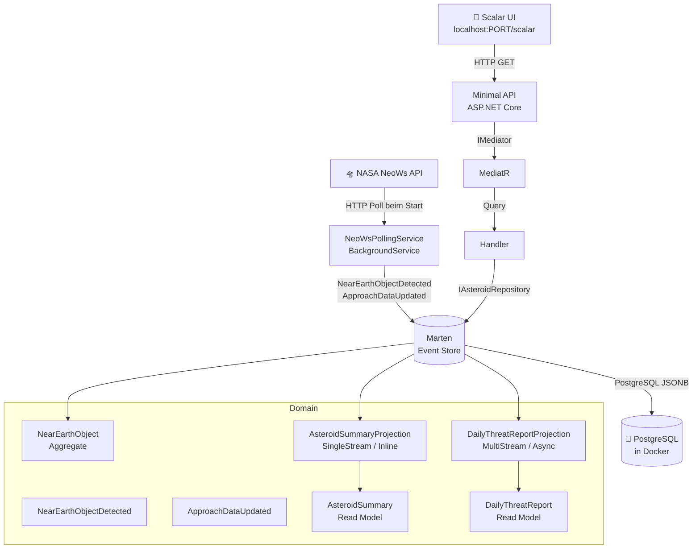
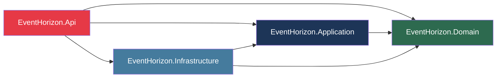

# 🌌 EventHorizon

> *"Captain's Log, Stardate 2026.02.28 – a near-Earth object has been detected..."*

**EventHorizon** ist ein C#/.NET Lernprojekt das **Event Sourcing mit Marten** anhand echter NASA-Weltraumdaten demonstriert.
Die NASA NeoWs API liefert täglich neue Asteroiden-Daten – jede Information wird als unveränderlicher Event in PostgreSQL gespeichert.
Was zunächst nach einem langweiligen Log-System aussieht, überwacht in Wirklichkeit den Weltraum. 🪨

---

## 🎯 Lernziele

Dieses Projekt zeigt in der Praxis:

- **Event Sourcing** – Zustand wird nicht überschrieben, sondern als Abfolge von Events gespeichert
- **Marten** als Event Store auf Basis von PostgreSQL
- **Aggregates** – wie Domänenobjekte aus Events rekonstruiert werden
- **Read Model Projektionen** – automatisch berechnete Lesemodelle aus Events
- **MultiStreamProjection** – Aggregation über alle Event Streams hinweg
- **Time Travel** – Zustand eines Aggregats zu einem beliebigen Zeitpunkt rekonstruieren
- **Clean Architecture** – saubere Schichtentrennung mit Abhängigkeitsregel
- **CQRS mit MediatR** – Commands und Queries vollständig entkoppelt
- **Background Services** in ASP.NET Core
- **Minimal API** mit Scalar als modernes Swagger UI
- **Externe API-Integration** mit dem NASA NeoWs Endpoint

---

## 🗺️ Architektur





---

## 🚀 Voraussetzungen

- [.NET 9 SDK](https://dotnet.microsoft.com/download)
- [Docker Desktop](https://www.docker.com/products/docker-desktop/)
- Visual Studio 2022 oder Rider

---

## ▶️ Projekt starten

### 1. Repository klonen

```bash
git clone https://github.com/lady-logic/EventHorizon.git
cd EventHorizon
```

### 2. Docker Desktop starten

Stelle sicher dass Docker Desktop läuft (grünes Symbol in der Taskleiste).

### 3. PostgreSQL starten

```bash
docker compose up -d
```

Prüfen ob der Container läuft:

```bash
docker ps
```

Du solltest `eventhorizon-db` mit Status `Up` sehen.

### 4. App starten

In Visual Studio: **Strg+F5**

Oder per CLI:
```bash
cd EventHorizon.Api
dotnet run
```

### 5. Scalar UI öffnen

Die App gibt beim Start die URL aus, z.B.:
```
Now listening on: http://localhost:5152
```

Öffne dann: **http://localhost:5152/scalar**

Beim Start pollt die App automatisch die NASA NeoWs API und speichert alle Asteroiden der nächsten 7 Tage als Events. Das Datenbankschema wird automatisch angelegt.

---

## 🔭 API Endpoints

| Method | Endpoint | Beschreibung |
|--------|----------|--------------|
| GET | `/` | Health Check |
| GET | `/asteroids` | Alle rohen Events im Event Store |
| GET | `/asteroids/summaries` | Read Model – alle bekannten Asteroiden |
| GET | `/asteroids/hazardous` | Read Model – nur potenziell gefährliche Asteroiden |
| GET | `/asteroids/{nasaId}/history?at={timestamp}` | Time Travel – Asteroid-Zustand zu einem Zeitpunkt |
| GET | `/threats/daily?date={date}` | DailyThreatReport – Tagesübersicht aller Bedrohungen |

---

## 📁 Projektstruktur

```
EventHorizon/
├── src/
│   ├── EventHorizon.Domain/               ← Kern, keine Abhängigkeiten nach außen
│   │   ├── Events/
│   │   │   └── NeoEvents.cs               ← NearEarthObjectDetected, ApproachDataUpdated
│   │   ├── Aggregates/
│   │   │   └── NearEarthObject.cs         ← Aggregate, rekonstruiert aus Events
│   │   ├── ReadModels/
│   │   │   ├── AsteroidSummary.cs         ← Read Model für Einzelabfragen
│   │   │   └── DailyThreatReport.cs       ← Read Model für Tagesberichte
│   │   └── Projections/
│   │       ├── AsteroidSummaryProjection.cs     ← SingleStream, Inline
│   │       └── DailyThreatReportProjection.cs   ← MultiStream, Async
│   │
│   ├── EventHorizon.Application/          ← CQRS, MediatR Queries & Handler
│   │   ├── Asteroids/
│   │   │   ├── Queries/                   ← GetAllAsteroidSummariesQuery,
│   │   │   │                                 GetHazardousAsteroidsQuery,
│   │   │   │                                 GetAsteroidAtPointInTimeQuery,
│   │   │   │                                 GetDailyThreatReportQuery
│   │   │   └── Handlers/                  ← Handler für jede Query
│   │   └── Interfaces/
│   │       └── IAsteroidRepository.cs     ← Port zur Infrastruktur
│   │
│   ├── EventHorizon.Infrastructure/       ← Konkrete Implementierungen
│   │   ├── Nasa/
│   │   │   ├── NasaApiClient.cs           ← HTTP Client für NASA NeoWs API
│   │   │   └── NasaApiModels.cs           ← Deserialisierungsmodelle
│   │   └── Persistence/
│   │       └── AsteroidRepository.cs      ← Marten-Implementierung von IAsteroidRepository
│   │
│   └── EventHorizon.Api/                  ← Einstiegspunkt
│       ├── BackgroundServices/
│       │   └── NeoWsPollingService.cs     ← Pollt NASA API beim Start
│       └── Program.cs
│
├── docker-compose.yml
└── README.md
```

---

## 💡 Das Event Sourcing Prinzip

In einer klassischen Datenbank wird der Zustand **überschrieben**. In EventHorizon wird jede Veränderung als **unveränderlicher Event** gespeichert:

```
Stream "2003 DZ15" (NASA ID: 3150194):
  [0] NearEarthObjectDetected  → Asteroid erstmals erkannt
  [1] ApproachDataUpdated      → Annäherungsdaten: 64.166.386 km, 8,9 km/s
  [2] ApproachDataUpdated      → Neue NASA-Berechnung: Bahn aktualisiert
  ...
```

Der aktuelle Zustand ist **immer aus der Geschichte berechenbar** – man kann zu jedem Zeitpunkt zurückspulen und fragen: *"Was wussten wir an Tag X über diesen Asteroiden?"*

### ⏱️ Time Travel

Marten kann jeden Asteroid-Zustand zu einem beliebigen Zeitpunkt rekonstruieren:

```
GET /asteroids/3150194/history?at=2026-03-01T00:00:00Z
→ Zustand von (2003 DZ15) wie er am 01.03.2026 war

GET /asteroids/3150194/history?at=2026-01-01T00:00:00Z
→ 404 Not Found – Asteroid war zu diesem Zeitpunkt noch nicht entdeckt
```

### 📊 DailyThreatReport

Eine `MultiStreamProjection` aggregiert täglich alle Asteroid-Streams zu einem Tagesbericht:

```json
{
  "date": "2026-03-04",
  "totalAsteroidsDetected": 110,
  "hazardousCount": 8,
  "closestApproachKm": 1476968.58,
  "closestAsteroidName": "54604134",
  "hazardousAsteroidNames": ["480858 (2001 PT9)", "(2022 YU4)", "..."]
}
```

---

## 🛣️ Roadmap

- [x] **Stufe 1** – Marten Event Store mit NASA NeoWs API
- [x] **Stufe 2** – Clean Architecture + CQRS mit MediatR + Read Model Projektionen
- [x] **Stufe 2+** – Time Travel + MultiStreamProjection (DailyThreatReport)
- [ ] **Stufe 3** – Observability mit Grafana + Loki + Prometheus

---

## 🔑 NASA API Key (optional)

Die App verwendet standardmäßig den kostenlosen `DEMO_KEY` (30 Requests/Stunde).

Für mehr Requests: Kostenloser API Key unter [api.nasa.gov](https://api.nasa.gov/)

Per User Secrets eintragen (empfohlen):
```bash
dotnet user-secrets set "Nasa:ApiKey" "DEIN_KEY_HIER"
```

---